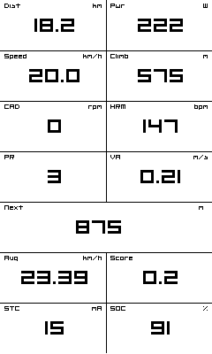
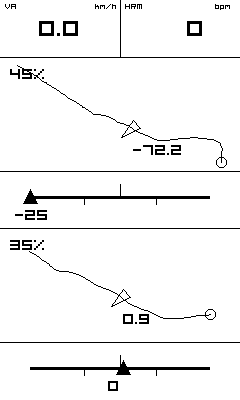
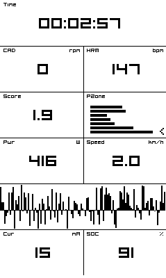
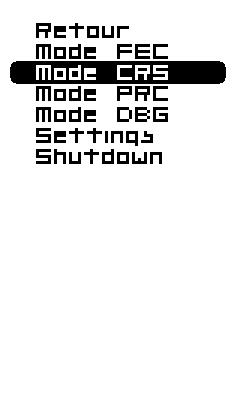
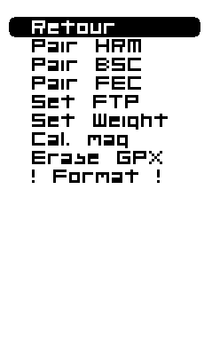

# Project

This application is an open-source small form-factor bicycle GPS computer.  

Included features: 
* Real-time compete with the internally stored Strava Segments (500+)
* Store GPX files and follow it on-screen with zoom options
* ANT+ connection to heart rate monitors, FE-C devices (smart home trainer), cadence & speed sensors...
* BLE connection to use the LNS, UART and Komoot (see https://www.komoot.com/)
* Estimate power using a precise barometer and special algorithms

Autonomy depends on the use: it uses <8mA in indoor mode (100+ hours), and around 35mA in outdoor modes (30+ hours).

## Hardware

This project uses Nordic nRF52840, a Cortex M4F MCU which can do BLE/ANT+ RF communications.  
The PCB can be found under: https://github.com/vincent290587/EAGLE/tree/master/Projects/myStravaB_V3  
The BOM costs around 100€

## Compilation & Programming

Must be compiled with GCC 6 2017-q2-update and nRF SDK V16.0 with softdevice s340 V6.1.1

/!\ The USB bootloader must be programmed before using the dfu targets (found in dfu subfolder)

cd pca10056/s340/armgcc  
make  
make flash_softdevice (or) make dfu_softdevice  
make flash            (or) make dfu  

## Roadmap

- [x] Strava segments compete
- [x] GPX file following on a map
- [x] Better menu-system
- [x] Turn-by-turn navigation (using the Komoot app)
- [x] Better power computation
- [x] ANT+ sensors pairing (FEC, HRM, BSC)
- [x] User settings (FTP, weight)
- [x] Better LED interaction
- [x] Connection to a BLE AP to unload recorded data

## Screenshots

Outdoor modes:

    

Indoor mode:

  

Menu:

 

