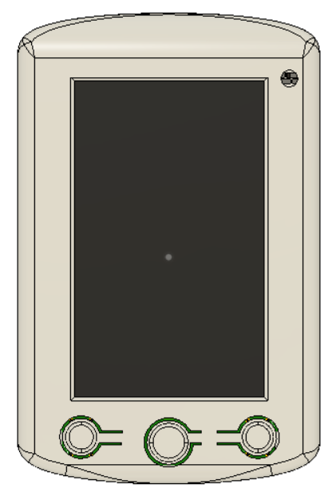

# Project

This application is an open-source small form-factor bicycle GPS computer.  

Included features:  

* Strava live segments (500+ segments max)
* Strava routes
* ANT+ connection to heart rate monitors, FE-C devices (smart home trainer), cadence sensors
* BLE connection to use Komoot (see <https://www.komoot.com/>)
* Phone application (GPS Ally v2)
* Estimate power / slope using a precise barometer and Kalman filtering

Autonomy depends on the use: it uses <8mA in indoor mode (100+ hours), and around 35mA in outdoor modes (30+ hours).

## Hardware

This project uses Nordic nRF52840, a Cortex M4F MCU which can do BLE/ANT+ RF communications.  
The PCB can be found under: <https://github.com/vincent290587/EAGLE/tree/master/Projects/myStravaB_V3>  
The BOM costs around 100 euros.  

Mechanical files are available in the STL folder.

## Compilation & Programming

You will first need to setup your Nordic SDK and download the right softdevice fron <http://www.thisisant.com> before running the following commands.  

/!\ Must be compiled with GCC 6 2017-q2-update and nRF SDK V16.0 with softdevice s340 V6.1.1

1- Flash softdevice 'cd pca10056/s340/armgcc && make flash_softdevice'  
2- Flash bootloader 'cd dfu/armgcc && make && make flash_dfu'  
3- Flash app 'cd pca10056/s340/armgcc && make flash_dfu'  

## Roadmap

- [x] Better menu-system
- [x] Turn-by-turn navigation (using the Komoot app)
- [x] Better power computation
- [x] ANT+ sensors pairing (FEC, HRM, BSC)
- [x] User settings (FTP, weight)
- [x] Better LED interaction
- [x] BLE Cycling power vector (ANT+ cycling dynamics equivalent)
- [x] Phone-app compatibility (GPS Ally v2)

## Screenshots

Outdoor modes:

    

Indoor mode:

  

Menu:

 

